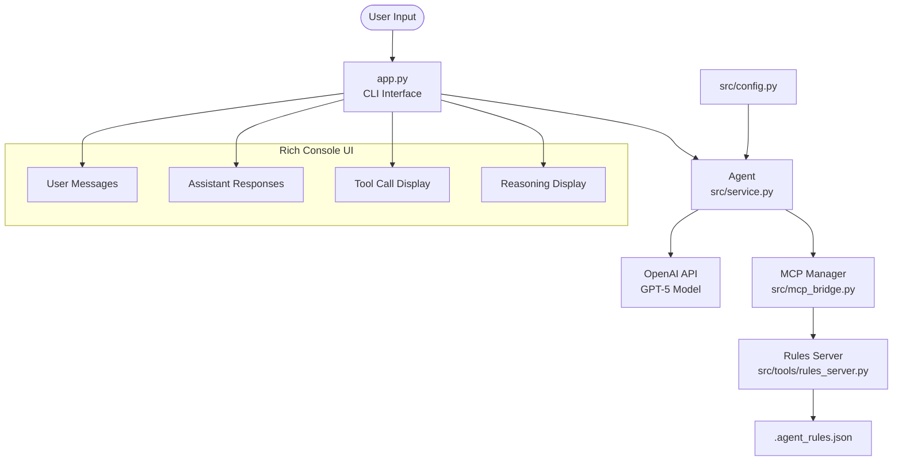

# AI Agent with MCP Integration

An intelligent conversational agent powered by OpenAI's GPT-5 model with Model Context Protocol (MCP) tool integration. The agent provides an interactive CLI interface with rich formatting and supports extensible tool capabilities through MCP servers.

## Architecture Overview



## Module Breakdown

### Core Components

- **`app.py`** - Main CLI application entry point with rich console interface
- **`src/service.py`** - Core Agent class handling OpenAI API communication and message processing
- **`src/mcp_bridge.py`** - MCP server management and tool integration bridge
- **`src/config.py`** - Configuration management and environment variables
- **`src/tools/rules_server.py`** - MCP server for persistent agent rule management

### Key Features

- **Interactive CLI**: Rich-formatted console interface with color-coded message panels
- **MCP Integration**: Extensible tool system using Model Context Protocol
- **Persistent Rules**: Dynamic agent behavior configuration via JSON storage
- **Streaming Responses**: Real-time response processing with tool call visualization
- **Signal Handling**: Graceful shutdown on interruption

## Installation & Setup

### Prerequisites

- Python 3.8+
- OpenAI API key

### Installation

1. **Create and activate conda environment**
   ```bash
   conda create -n aimcpagent python=3.11
   conda activate aimcpagent
   ```

2. **Clone the repository**
   ```bash
   git clone <repository-url>
   cd ai-agent
   ```

3. **Install dependencies**
   ```bash
   pip install -r requirements.txt
   ```

4. **Configure environment**
   ```bash
   cp .env.example .env
   # Edit .env and add your OpenAI API key
   OPENAI_API_KEY='sk-your-api-key-here'
   ```

### Dependencies

```
openai==1.99.6      # OpenAI API client
rich==14.1.0        # Rich console formatting
python-dotenv==1.1.1 # Environment variable management
mcp==1.12.4         # Model Context Protocol
```

## Usage

### Starting the Agent

```bash
python app.py
```

### Basic Interaction

The agent starts with an interactive prompt:

```
Agent (GPT-5 + MCP) started. Type 'exit' to quit.

> Hello, how can you help me?
```

### Available Commands

- **Chat**: Type any message to interact with the agent
- **Exit**: Type `exit` or `quit` to terminate the session
- **Tool Usage**: The agent automatically uses available MCP tools when appropriate

### Rule Management

The agent includes a built-in rules system for persistent behavior configuration:

- **View rules**: Agent can display current rules via MCP tools
- **Set rules**: Modify agent behavior (tone, formatting, explanations)
- **Delete rules**: Remove specific behavioral rules

Current default rules:
- **Tone**: Concise, friendly
- **Formatting**: Prefer bullets, minimal markup  
- **Explanations**: Default brief; add detail on request

## Configuration

### Environment Variables

- `OPENAI_API_KEY` - Your OpenAI API key (required)
- `OPENAI_MODEL` - Model to use (default: "gpt-5")

### Rule Storage

Agent rules are stored in `.agent_rules.json` in the project root and persist across sessions.

## GPT-5 Materials

[GPT-5 Prompting Guide](https://cookbook.openai.com/examples/gpt-5/gpt-5_prompting_guide)
[GPT-5 Tools & Controls & Styles](https://cookbook.openai.com/examples/gpt-5/gpt-5_new_params_and_tools)
[OpenAI Agents SDK](https://openai.github.io/openai-agents-python/)


## Development

### Project Structure

```
ai-agent/
├── app.py                    # CLI entry point
├── src/
│   ├── config.py            # Configuration management
│   ├── service.py           # Core agent logic
│   ├── mcp_bridge.py        # MCP integration
│   └── tools/
│       └── rules_server.py  # Rules management server
├── requirements.txt         # Python dependencies
├── .env.example            # Environment template
└── .agent_rules.json       # Persistent agent rules
```

### Adding New MCP Servers

1. Create new server file in `src/tools/`
2. Implement using FastMCP framework
3. Add server path to initialization in `app.py:28`

### Extending the Agent

The agent architecture supports:
- Multiple MCP servers
- Custom tool implementations  
- Configurable response formatting
- Persistent state management

### Target Agent Features (TODO):

- Core Cognitive Abilities
    + - on-demand strong reasoning engine – can handle multi-step logical deductions, causal reasoning, and counterfactual thinking.
    + - Planning & Goal Management – Breaks down large objectives into smaller actionable steps and tracks progress.
    - Chain-of-Thought Execution – Uses internal reasoning before responding, to avoid jumping to conclusions.
    - Self-Correction – Re-evaluates its answers mid-conversation if new data contradicts previous assumptions.
- Memory & Context Handling
    - Long-Term Memory – Stores and recalls user preferences, past discussions.
    + - Short-Term Context Window – Handles large, complex conversations without “forgetting” early parts.
    - Retrieval-Augmented Memory – Pulls facts from external databases or embeddings when needed.
- Tool & API Integration
    + - Web Search Integration – Retrieves up-to-date facts instead of relying only on pretraining.
    + - Code Execution Sandbox – Runs Python/JavaScript for calculations, simulations, and quick prototyping.
    + - Document & Data Parsing – Reads PDFs, spreadsheets, JSON, etc., and extracts structured info.
- Multi-Modal Capabilities
    + - Image Understanding - Reads diagrams, charts, and screenshots.
- Interaction & Adaptability
    - Persona & Tone Control - Carefully follows predefined persona traits, knowledge, characteristics, preferences;
- Autonomy & Learning
    - Self-Learning from Feedback – Improves answers over time based on corrections or ratings.
    - Proactive Suggestions – Offers relevant next steps without waiting for user prompts.